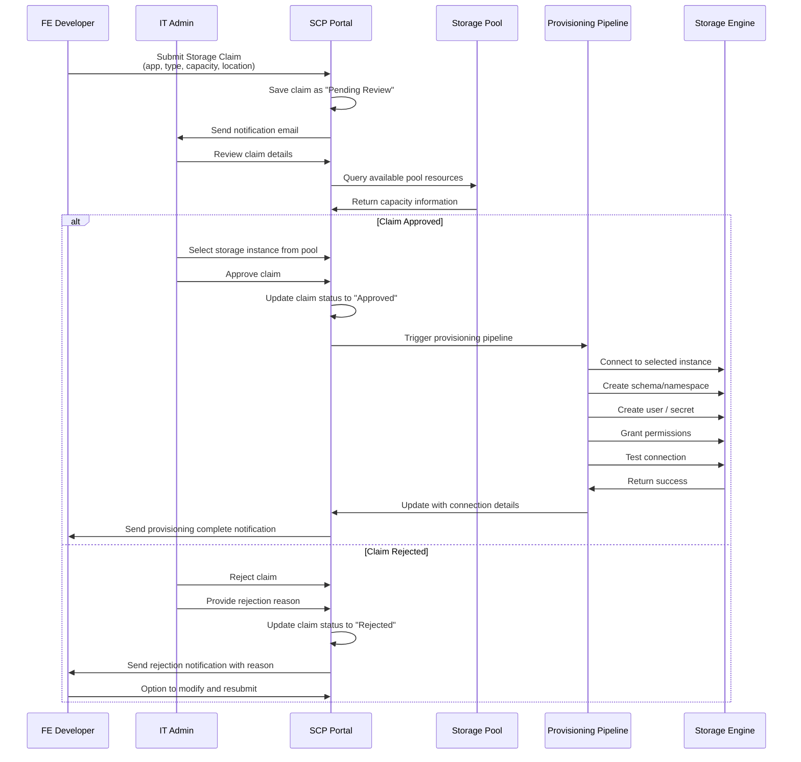

Test

```mermaid
sequenceDiagram
    participant D as FE Developer
    participant A as IT Admin
    participant S as SCP Portal    
    participant P as Storage Pool
    participant Pipe as Provisioning Pipeline
    participant E as Storage Engine
    
    D->>S: Submit Storage Claim<br/>(app, type, capacity, location)
    S->>S: Save claim as "Pending Review"
    S->>A: Send notification email

    A->>S: Review claim details
    S->>P: Query available pool resources
    P->>S: Return capacity information
    
    alt Claim Approved
        A->>S: Select storage instance from pool
        A->>S: Approve claim
        S->>S: Update claim status to "Approved"
        S->>Pipe: Trigger provisioning pipeline
        
        Pipe->>E: Connect to selected instance
        Pipe->>E: Create schema/namespace
        Pipe->>E: Create user / secret
        Pipe->>E: Grant permissions
        Pipe->>E: Test connection
        
        E->>Pipe: Return success
        Pipe->>S: Update with connection details
        S->>D: Send provisioning complete notification
    else Claim Rejected
        A->>S: Reject claim
        A->>S: Provide rejection reason
        S->>S: Update claim status to "Rejected"
        S->>D: Send rejection notification with reason
        D->>S: Option to modify and resubmit
    end

```
